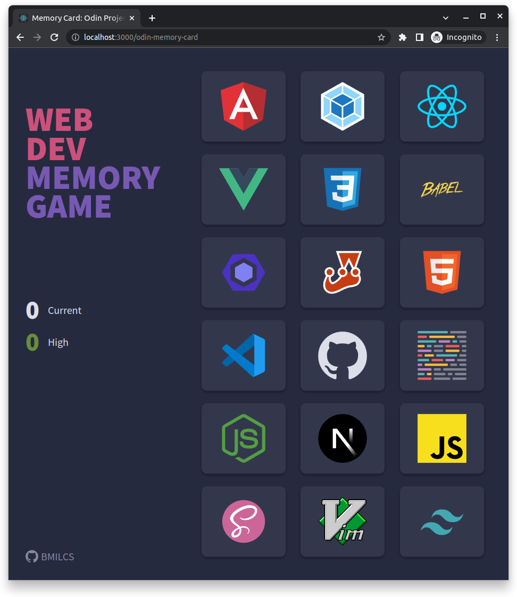
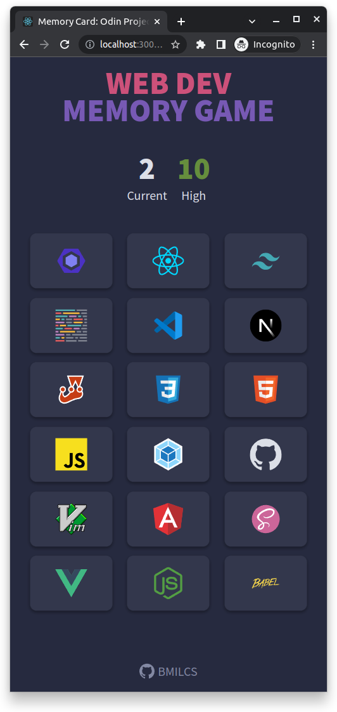

# Odin Project #20: Memory Card

Welcome to Bryan Miller's Memory Card Project, the [twentieth assignment](https://www.theodinproject.com/lessons/node-path-javascript-memory-card) within the Odin Project curriculum. The goal of this repo is to practice the following skill sets:

- React
  - Functional Components
  - Hooks
    - `useState`
    - `useEffect` (wasn't necessary but used it anyways)
- SASS
  - Responsive Design
    - Media Queries
    - Variable font-sizes
    - Grid Template Areas
  - `pointer-events: none` (forcing `e.target` to fallback to another element)
  - `user-select: none` (preventing text from being highlighted on repetitive fast clicks)

## Summary

Memory Card was my second project written in React and it was my first look at functional components. I have to say that this project sealed the deal on my love for React, especially with the cleaner and more readable functional approach.

Before diving into coding, I spent extra time on planning and pseudo-code and it was worth the effort. Unlike my last project, I laid out the entire project's file structure ahead of time, with placeholder components & got to work. As a result, I completed the entire project in less than a day.

However, I wasn't thrilled with the layout so I spent a few extra hours the next day on refactoring the scoreboard and made the layout a responsive one. `useEffect()` didn't appear anywhere in my code base so I refactored the `shuffleDeck()` function to trigger when the `currentScore` state variable changes.

## Project Component Structure:

```js
 // Primary Layout
 App:            parent: initializes score state, pieces together the page
   Header:       page title
   Footer:       github repo link
   Scoreboard:   displays scores, current / high, from props
   Game:         "main" component - game logic/state & card click handler
     Gameboard:  renders grid of <Card /> components
       Card:     generate individual cards
```

## Card Data

All card information is stored in a single array of card objects within in `src/modules/cardList.js`.

Each card object has two keys: `{ name, SVG }`.

- `name` contains the name of the web technology
- `SVG` contains an imported React component, containing the logo in SVG format

Example:

```js
// src/modules/cardList.js
import Angular from "../assets/Angular";
// ...

export const cardList = [
  {
    name: "Angular",
    SVG: Angular,
  },
  //...
];
```

## Piecing It All Together

With all of the card data organized in it's own array, the `Game` component simply imports `cardList` and passes it downward to the `Gameboard` and then `Card` component through props. From there, the cards are rendered to the page.

```js
// src/components/Game.js
import { cardList } from "../modules/cardList";
//...

export default function Game(props) {
  const [cards, setCards] = useState(cardList);
  //...
  return <Gameboard allCards={cards} onClick={handleCardClick} />;
}
```

The `Game` component contains the bulk of the game flow logic:

- Click Handler for cards: extracts the clicked card's name through `e.target`'s dataset attribute: `data-cardname`
- Stores an array of previously clicked cards
- Determines when a round is over, or the same card is clicked twice
- Updates score: state variables through props (originating in `App` component)

In order to practice using `useEffect()`, the shuffling of cards occurs when the `currentScore` value changes --- which is triggered when the user clicks on a card:

```js
useEffect(() => {
    const shuffleDeck = () => {
      // utilizes the fisher-yates (aka knuth) shuffle algorithm
      //...
      }

      // update state with the newly shuffled deck array
      setCards(shuffledDeck);
    };

    // shuffle deck on currentScore change
    shuffleDeck();
  }, [currentScore]);
```

**Note**: This wasn't how I originally approached the problem because I don't believe it makes the logic better. It seemingly makes it less readable and more difficult to reason about. However, `useEffect()` was the focus of a previous lesson and I wanted to put it into practice.

## TLDR

Memory Card was a quick, fun and easy project that taught me several things:

- Organization, planning ahead & pseudo-code save us a lot of time & effort in the long run
- Functional components & Hooks: `useState()` and `useEffect()`
- Responive design techniques & troubleshooting

## Screenshots

> Desktop
> 

> Mobile
> 

## Links

- [Live Demo](https://bmilcs.github.io/odin-memory-card/)
- [My Odin Project Progress](https://github.com/bmilcs/odin-project)

## Deployment

```sh
# clone repo & change directories
git clone https://github.com/bmilcs/odin-memory-card
cd odin-memory-card

# install all dependencies
npm install

# run app
npm start
```
